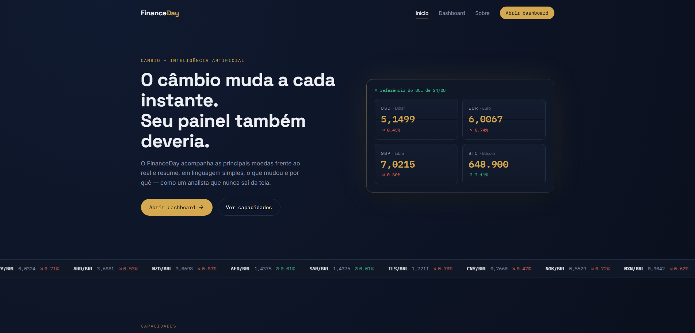

# 🌍 FinanceDay — Dashboard Global de Câmbio e Moedas em Tempo Real

Um painel financeiro global de alta performance desenvolvido para acompanhar flutuações de moedas em tempo real, combinando um design moderno e imersivo (com conceito de display split-flap) a análises inteligentes de câmbio.

---

## 📸 Demonstração do Projeto

  

---

## 🚀 Tecnologias Utilizadas

Este projeto foi construído utilizando tecnologias modernas do ecossistema front-end:

* **Framework/Biblioteca:** React, Vite, JavaScript / TypeScript
* **Estilização:** Tailwind CSS (com paleta dark customizada)
* **Consumo de APIs:** Frankfurter API e integração com serviços de inteligência artificial
* **Hospedagem & Deploy:** Vercel

---

## ⚙️ Principais Funcionalidades

* **Cotações em Tempo Real:** Acompanhamento dinâmico das principais moedas frente ao Real (BRL) e outras divisas globais[cite: 12].
* **Análise Inteligente (IA):** Resumos e insights gerados de forma automatizada sobre as variações cambiais do mercado[cite: 12].
* **Interface Imersiva e Fluida:** Design refinado voltado para a experiência do usuário (UX), com animações e componentes interativos estilo split-flap.
* **Navegação Modular:** Alternância fluida entre a página de apresentação institucional e o dashboard analítico[cite: 12].